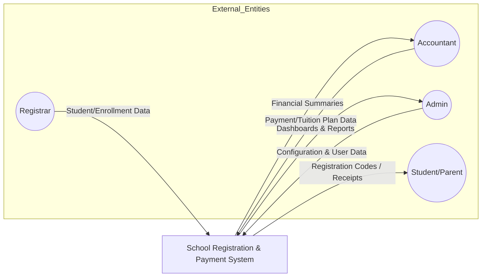
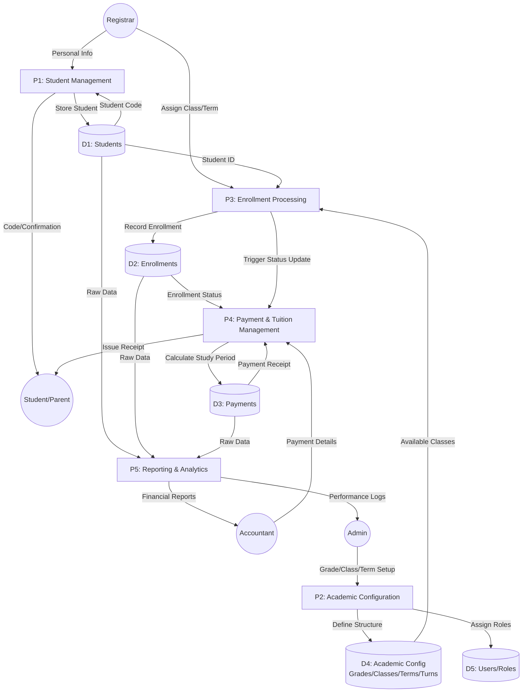

# Data Flow Diagram (DFD) - School Registration & Payment System

This document outlines the flow of data within the School Registration & Payment System, illustrating how information moves between external entities, processes, and data stores.

## 1. System Context Diagram (Level 0)

The Level 0 diagram shows the system as a single process interacting with external entities.

---

## 2. Detailed Data Flow Diagram (Level 1)

The Level 1 diagram breaks down the main system into its primary functional processes.

---

## 3. Data Flow Definitions

| Entity/Store | Description |
| :--- | :--- |
| **Registrar** | Staff responsible for entering student details and performing initial class assignments. |
| **Accountant** | Staff managing the financial side, from setting tuition prices to recording payments. |
| **D1: Students** | Stores `first_name`, `last_name`, `student_code`, `date_of_birth`, and `parent_contact`. |
| **D2: Enrollments** | Links a Student to a Classroom and a Term. Tracks `status` (Active/Dropped). |
| **D3: Payments** | Stores transaction details including `start_study_date` and `end_study_date`. |
| **D4: Academic Config** | Central store for Grades (1-6), Classrooms (A, B, C), Terms (2025, 2026), and Turns (Morning, Afternoon). |

---

## 4. Prompt Used to Generate This Diagram

If you need to regenerate or expand this diagram in the future, you can use the following prompt:

> **"Act as a System Architect. Based on a Laravel School Management codebase, create a Level 1 Data Flow Diagram (DFD) using Mermaid.js. Focus on the lifecycle of a Student: from initial registration (P1) and enrollment into a class (P3), to payment processing (P4) which calculates study duration based on monthly plans. Include data stores for Students, Enrollments, Payments, and Academic Configuration (Grades/Classrooms/Terms). Ensure entities like Registrar, Accountant, and Admin are clearly mapped to their respective processes and data flows."**
