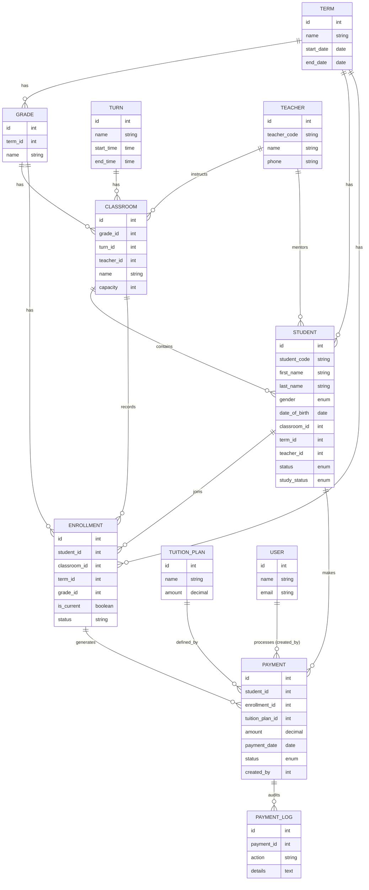

# School Registration & Payment System - Entity Relationship Diagram

This document illustrates the data structure and relationships within the School Registration & Payment System.

## ER Diagram (Mermaid)

## Entity Descriptions

### Core Academic Entities
- **Term**: Represents academic periods (e.g., Semester 1, Semester 2). All students and enrollments are tied to a term.
- **Grade**: Logical levels (e.g., Grade 1, Grade 2). Each grade belongs to a specific term and contains classrooms.
- **Turn**: Study shifts (e.g., Morning, Afternoon, Evening).
- **Teacher**: Contains instructor details. A teacher can instruct multiple classrooms and be a mentor to specific students.
- **Classroom**: The physical or logical class unit. It links a Grade, a Turn, and a Teacher.

### Student & Enrollment
- **Student**: The central entity containing demographic and academic status information.
- **Enrollment**: Acts as a join table with historical tracking. It records which classroom, grade, and term a student was part of at a specific time. `is_current` indicates the active placement.

### Payment System
- **TuitionPlan**: Defined pricing models for different courses or grades.
- **Payment**: Records financial transactions. Each payment is linked to a student, an enrollment record, and a tuition plan.
- **PaymentLog**: Stores audit trails for payment modifications or status changes.
- **User**: The administrative staff member who processed the transaction.

## Key Relationships Logic
1. **Student Placement**: A Student is directly linked to a `classroom_id`, but the `enrollment` table tracks the history of these placements across terms and grades.
2. **Financial Tracking**: Payments are linked to both `student_id` and `enrollment_id`. This ensures that payments are correctly attributed to the specific class/term period.
3. **Teacher Assignment**: Teachers are linked both to `classrooms` (operational) and directly to `students` (mentorship/primary contact).
